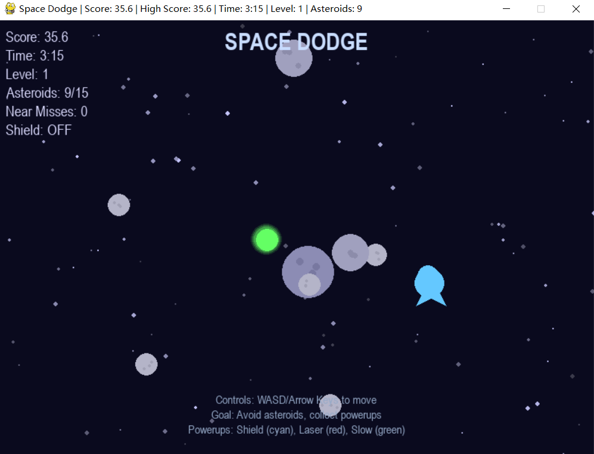
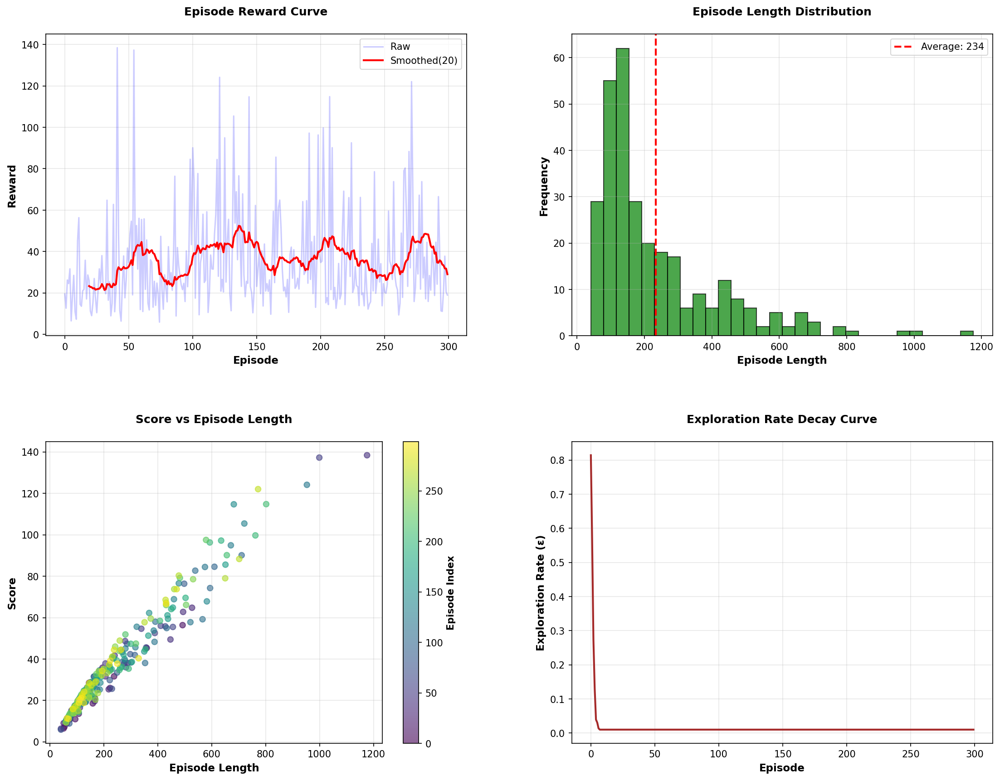

# Space Dodge – Deep Q-Learning Game

🎮 An AI agent learns to pilot a spaceship through an asteroid field using Deep Q-Network (DQN).

## 📹 Demo Video
https://youtu.be/S5sOeOxj_zQ

## 🎯 Game Overview
- Control a spaceship with four directional movements.
- Avoid asteroids and collect power-ups (shield, laser, slow).
- Survive as long as possible – the level increases over time.

## 🧠 Algorithm
- Deep Q-Network implemented from scratch with NumPy.
- State space: 42-dimensional vector (ship, nearest asteroids, power-ups, etc.).
- Action space: 5 discrete actions (Up, Down, Left, Right, No-op).
- Experience replay (buffer size 20,000) and ε-greedy exploration.

## 📸 Gameplay

  
*Training curve showing score improvement over 300 episodes.*

## 🚀 How to Run
1. Install dependencies:  
   ```bash
   pip install -r requirements.txt